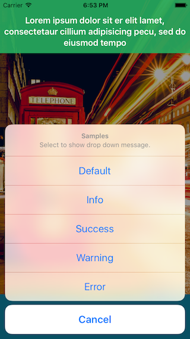
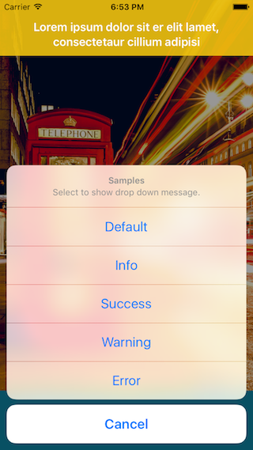
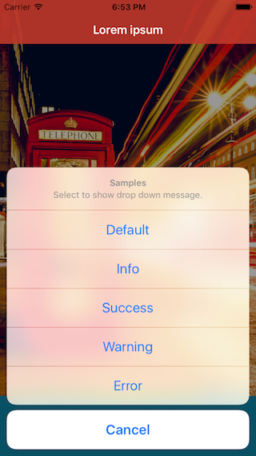
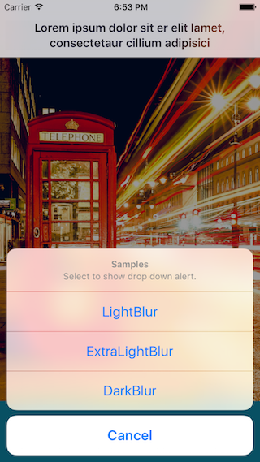
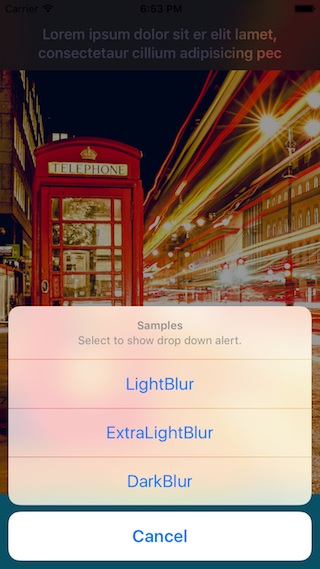

# SwiftyDrop

SwiftyDrop is a lightweight pure Swift simple and beautiful dropdown message.

[](http://cocoadocs.org/docsets/SwiftyDrop) [](http://cocoadocs.org/docsets/SwiftyDrop) [](http://cocoadocs.org/docsets/SwiftyDrop)
[](https://github.com/Carthage/Carthage)
[](https://gitter.im/morizotter/SwiftyDrop?utm_source=badge&utm_medium=badge&utm_campaign=pr-badge&utm_content=badge)

##Features

- Easy to use like: `Drop.down("Message")`
- Message field expands depending on the message.

##How it looks

### States





## Blurs



## iPad


##Runtime Requirements

- iOS8.1 or later
- Xcode 6.3

## Installation and Setup

**Note:** Embedded frameworks require a minimum deployment target of iOS 8.1.

**Information:** To use SwiftyDrop with a project targeting iOS 8.0 or lower, you must include the `SwiftyDrop/Drop.swift` source file directly in your project.

**Swift2:** Currently master is for Swift1.2. When you want to try Swift2, change library destination as describes below sections.

###Installing with CocoaPods

[CocoaPods](http://cocoapods.org) is a centralised dependency manager that automates the process of adding libraries to your Cocoa application. You can install it with the following command:

```bash
$ gem update
$ gem install cocoapods
$ pods --version
```

To integrate TouchVisualizer into your Xcode project using CocoaPods, specify it in your `Podfile` and run `pod install`.

```bash
platform :ios, '8.1'
use_frameworks!
pod 'SwiftyDrop', '~>1.0'
```

*for Swift2**

```bash
pod 'SwiftyDrop', :git => 'git@github.com:morizotter/SwiftyDrop.git', :branch => 'swift_2.0'
```

###Installing with Carthage

Just add to your Cartfile:

```ogdl
github "morizotter/SwiftyDrop" >= 1.0.0
```

###Manual Installation

To install SwiftyDrop without a dependency manager, please add all of the files in `/SwiftyDrop` to your Xcode Project.

##Usage

### Basic
To start using SwiftyDrop, write the following line wherever you want to show dropdown message:

```swift
import SwiftyDrop
```

Then invoke SwiftyDrop, by calling:

```swift
Drop.down("Message")
```

It is really simple!

### States and Blurs
SwiftyDrop has 2 types of display. First is **State**. Second is **Blur**. You can customize looks using them. Examples are:

```swift
Drop.down("Message", state: .Success)

Drop.down("Message", blur: .Light)
```

**States** are enum:
- .Default
- .Info
- .Success
- .Warning
- .Error

**Blurs** are also enum:
- .Light
- .ExtraLight
- .Dark

##Contributing

Please file issues or submit pull requests for anything you’d like to see! We're waiting! :)

##Licensing
SwiftyDrop is released under the MIT license. Go read the LICENSE file for more information.
